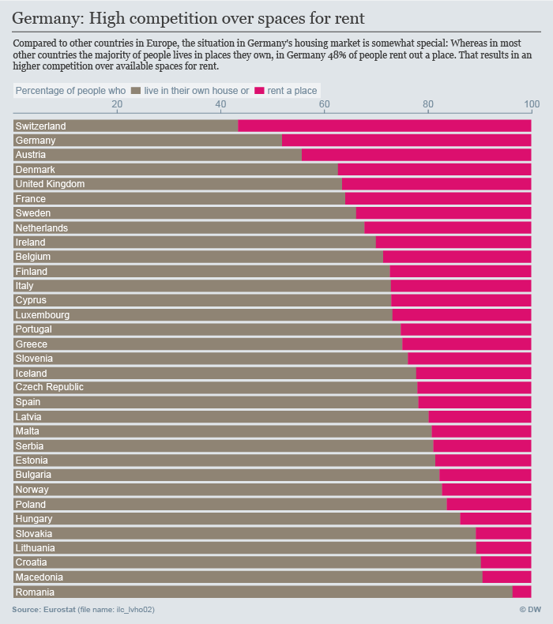
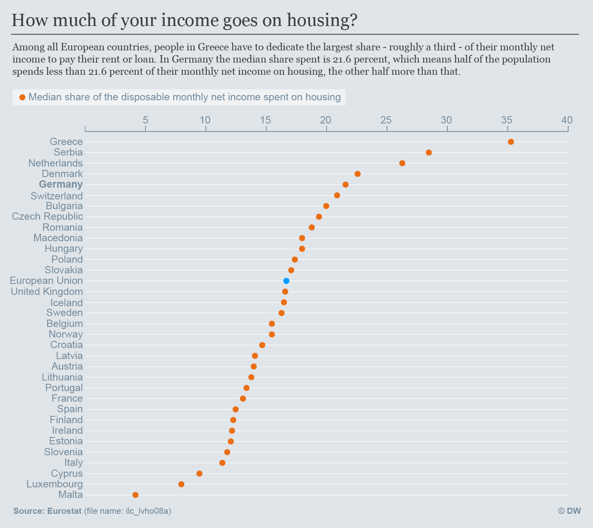
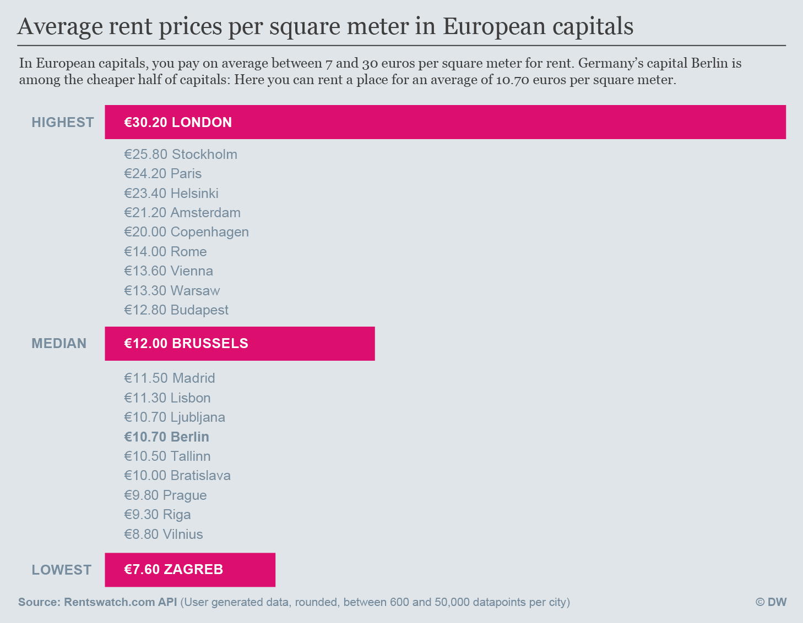

# How does the housing situation in Germany differ from other European countries?

### Data Sources

Eurostat [ilc_lvho02](http://ec.europa.eu/eurostat/en/web/products-datasets/-/ilc_lvho02)
Eurostat [ilc_lvho08a](http://ec.europa.eu/eurostat/en/web/products-datasets/-/ILC_LVHO08A)
RentsWatch data via their [API](http://api.rentswatch.com/)

### Output
In Germany the share of people living for rent is second highest among all European countries - thus, the competition for available places to rent is comparatively high

In addition to that, Germans rank on place 5 when it comes to the share of income dedicated to housing costs

But still, if you compare rent prices per square meter, Berlin is on average still cheaper than many other European capitals.

